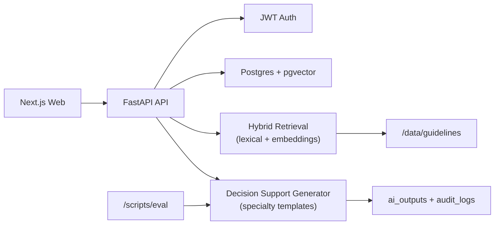

# DiagAssistAI

DiagAssistAI is a synthetic-data-only clinician-in-the-loop clinical intake and decision-support demo.

## Safety Disclaimer

- Educational demo; not for real clinical use.
- Decision support only. Final diagnosis must be clinician-confirmed.
- Synthetic data only. Do not use real PHI.

## Stack

- Web: Next.js (App Router), TypeScript, Tailwind
- API: FastAPI, Pydantic, SQLAlchemy, Alembic
- Database: PostgreSQL 16 + pgvector
- Auth: API-centric JWT email/password
- Data: synthetic Synthea subset + DDXPlus-derived eval fixtures + curated guideline docs

## Monorepo Layout

- `/Users/vikramkini/DiagAssistAI/apps/web` - frontend
- `/Users/vikramkini/DiagAssistAI/apps/api` - backend API
- `/Users/vikramkini/DiagAssistAI/packages/shared` - shared TS contracts
- `/Users/vikramkini/DiagAssistAI/data/guidelines` - RAG evidence corpus
- `/Users/vikramkini/DiagAssistAI/data/synthea` - synthetic seed data
- `/Users/vikramkini/DiagAssistAI/data/eval` - synthetic eval fixtures
- `/Users/vikramkini/DiagAssistAI/scripts` - ingest/seed/eval scripts

## Architecture



## Implemented MVP Features

1. Auth
- `POST /auth/signup`
- `POST /auth/login`
- `POST /auth/logout`
- `GET /me`

2. Clinician profile
- `GET /clinicians/me`
- `PUT /clinicians/me`

3. Patients and encounters
- `GET /patients`
- `POST /patients`
- `GET /patients/{id}`
- `GET /patients/{id}/encounters`
- `POST /encounters`
- `GET /encounters/{id}`
- `POST /encounters/{id}/confirm-diagnosis`
- `GET /encounters/{id}/audit`

4. AI pipeline
- `POST /transcribe` (Whisper when key exists, deterministic fallback otherwise)
- `POST /extract-intake`
- `POST /decision-support`
- `GET /encounters/{id}/evidence`

5. Settings
- `GET /settings`
- `PUT /settings`

## Specialty Adaptation (No Heavy Fine-Tuning)

Specialties in MVP:
- General
- Pediatrics
- Physiotherapy
- Dermatology

Adaptation is implemented via:
- specialty-tag retrieval boost/filter
- specialty-specific prompt/template constraints
- specialty-specific output limits

Config file:
- `/Users/vikramkini/DiagAssistAI/apps/api/app/templates/specialties.json`

## Data Model

Core tables:
- `clinicians`
- `patients`
- `encounters`
- `ai_outputs`
- `audit_logs`
- `guideline_docs`
- `guideline_chunks`

Indexes:
- B-tree on FK/id/time fields
- GIN on `guideline_chunks.tsv`
- pgvector index on `guideline_chunks.embedding`

Migration file:
- `/Users/vikramkini/DiagAssistAI/apps/api/alembic/versions/0001_initial_schema.py`

## Run (Docker Compose)

1. Copy envs:
```bash
cp .env.example .env
```

2. Start stack:
```bash
docker compose up --build
```

3. Open:
- API docs: `http://localhost:8000/docs`
- Web app: `http://localhost:3000`

## Seed and Ingest

Run inside API container:

```bash
python /workspace/scripts/ingest_guidelines.py
python /workspace/scripts/seed_demo_data.py
```

Seeded demo users (password: `demo12345`):
- `general@demo.local`
- `peds@demo.local`
- `physio@demo.local`
- `derm@demo.local`

## Demo Mode and API Keys

Environment variables:
- `DEMO_MODE=true` (default behavior when keys are missing)
- `STORE_AUDIO=false` (default; transcripts/structured output stored)
- `OPENAI_API_KEY=` (optional)

Behavior:
- If `OPENAI_API_KEY` exists, transcription and LLM generation can use OpenAI.
- If not, deterministic fallback paths are used so the demo remains runnable.

## Evaluation Harness

Command:
```bash
python scripts/eval/run_eval.py
```

Input fixture:
- `/Users/vikramkini/DiagAssistAI/data/eval/ddxplus_cases.jsonl` (20 synthetic cases)

Output report:
- `/Users/vikramkini/DiagAssistAI/scripts/eval/report.json`

Metrics:
- extraction completeness
- red-flag recall
- citation coverage
- latency per step
- consistency checks

## Tests

API tests:
```bash
cd apps/api
pytest
```

Web build:
```bash
cd apps/web
npm install
npm run build
```

## CI

GitHub Actions workflow:
- `/Users/vikramkini/DiagAssistAI/.github/workflows/ci.yml`

Jobs:
- API tests
- Eval harness in demo mode
- Web build validation

## Notes

- Authoritative diagnosis data source is clinician-confirmed `final_diagnosis_text`.
- AI outputs are audit artifacts for decision support, not diagnoses.
